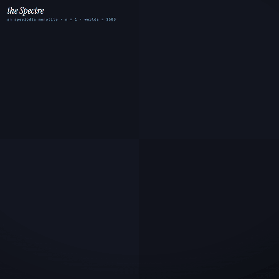
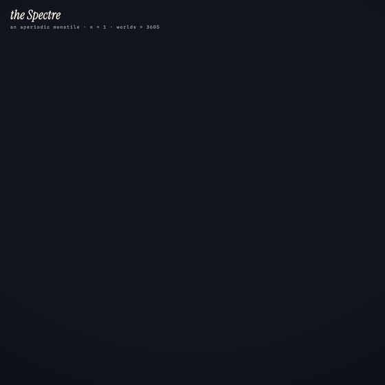
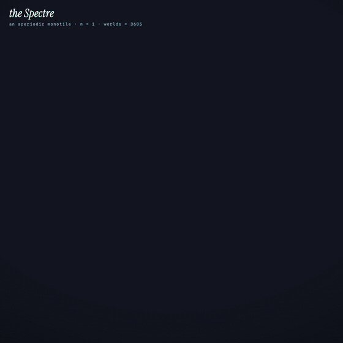
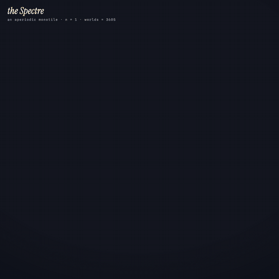
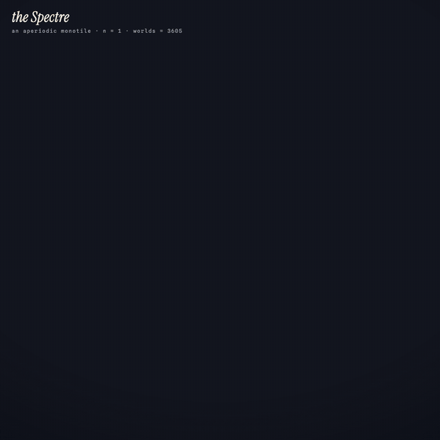

# the Spectre playground

An interactive playground for the [Spectre](https://arxiv.org/abs/2305.17743), the
"aperiodic monotile" discovered in 2023: a single shape that tiles the whole plane,
yet never repeats.

**Play it here: [remifabre-spectre-playground.static.hf.space](https://remifabre-spectre-playground.static.hf.space)**

<p align="center">
  
  
</p>

## What it does

You always hold a ghost tile. It snaps to valid positions, click to place, hold and
sweep to paint whole strokes. Three placement modes:

- **guided** (default): only offers placements that extend to a perfect tiling.
- **local**: any edge-to-edge fit (**worlds** hits zero if a perfect tiling is no
  longer possible).
- **free**: stamp anywhere.

Also:

- **auto**: tiles a disc by itself, outer ring first.
- **brush**: pick a color, new tiles take it, click a tile to repaint it.
- **replay**: plays any board back like sheet music (loops, scrubbable, continue
  building from any point).
- **share**: copy a replay link, or publish your shape by name to a public gallery
  anyone can browse and load.

<p align="center">
  
  
  
</p>

## The loop

<p align="center">
  
</p>

A sunset mountain of spectres builds itself; the camera orbits it, dives underneath,
and finds a second world hanging below: the letter pi, dissolving tile by tile until
only a gold keystone remains. Watch it
[with its soundtrack](media/E24-final-rise.mp4) (every note is synthesized in code
and locked to a tile event). The scripts that made it, and every iteration along the
way, live in [`generation/`](generation/).

## How guided mode works

The discovery papers prove that every Spectre tiling carries a unique hierarchical
structure generated by substitution rules. The playground precomputes a large,
provably correct patch from those rules and keeps track of every way your figure
still embeds into it. A placement is offered exactly when at least one embedding
survives it; the surviving count is the **worlds** number on screen. The patch grows
automatically as your figure grows, keeping a safety margin.

The full argument, with each claim labelled proven, confident, heuristic, or
unknown, is on the [about page](https://remifabre-spectre-playground.static.hf.space/about.html).
If you spot an error in it, please open an issue.

## The public gallery

Published shapes live in the dataset
[RemiFabre/spectre-shapes](https://huggingface.co/datasets/RemiFabre/spectre-shapes),
one JSON file per shape (tile order and colors included, so every shape replays).
Publishing goes through a small companion Space,
[spectre-ingest](https://huggingface.co/spaces/RemiFabre/spectre-ingest), which
validates records and rejects taken names. It also tallies anonymous visit beacons.
No IP addresses or user agents are logged or stored, ever.

## Running and testing

Everything is vanilla JavaScript on a single canvas, no build step:

```
python3 -m http.server 8000        # then open http://localhost:8000
node test.cjs                      # geometry and matching-rule tests
node test-patch.cjs                # substitution patch and embedding tests
```

`spectre.js` holds the whole engine: the Tile(1,1) geometry, the matching rule
(rotations only, odd edge to even edge, no overlap), the substitution system, and
the embedding machinery.

## References

- D. Smith, J. S. Myers, C. S. Kaplan, C. Goodman-Strauss,
  [An aperiodic monotile](https://arxiv.org/abs/2303.10798) (2023). The Hat.
- D. Smith, J. S. Myers, C. S. Kaplan, C. Goodman-Strauss,
  [A chiral aperiodic monotile](https://arxiv.org/abs/2305.17743) (2023). The Spectre.
- S. Tatham, [Combinatorial coordinates for the aperiodic Spectre tiling](https://www.chiark.greenend.org.uk/~sgtatham/quasiblog/aperiodic-spectre/).
- Substitution rules ported from [reversi-fun/symbolic-spectre-tiles](https://github.com/reversi-fun/symbolic-spectre-tiles).

MIT license.
